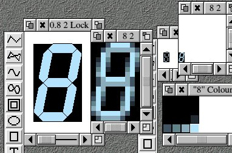

## MkSprite RISC OS tool

# Overview

The MkSprite tool makes fairly optimal RISC OS Sprite files from DrawFiles and Euclid files
It is designed to be easy to use in a makefile. It was written by Thomas Olsson (https://www.armware.dk/).

## Requirements

* RISC OS, and a certain amount of laziness.
* The Euclid module (if you want to convert Euclid files). 

## List of main features

* Adjustable accuracy, mask level etc.
* Control files for adjusting the options for certain files. 

## Example

What you see here, is the original draw file at 8:1 scaling, then the resultant sprite file at 8:1, and then both of these again at 1:1. Note that what you see might be very inaccurate if you're displaying this screenshot with e.g. only 256 colours on the screen

## Installation

* Download a release Zip archive from the [Releases page](https://github.com/gerph/thomasolsson-mksprite/releases).
* Extract the archive on RISC OS.
* Copy the `Library.mksprite` file into your library.
